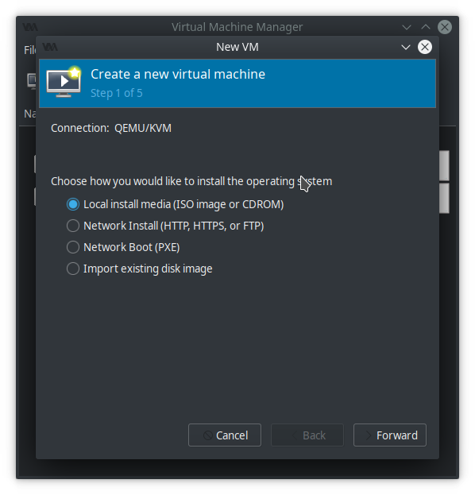
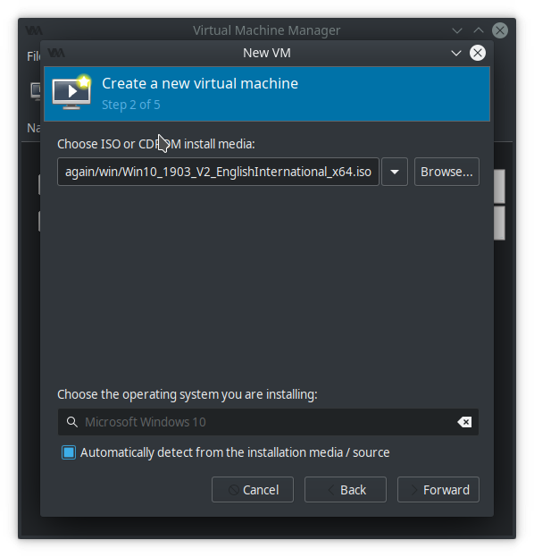
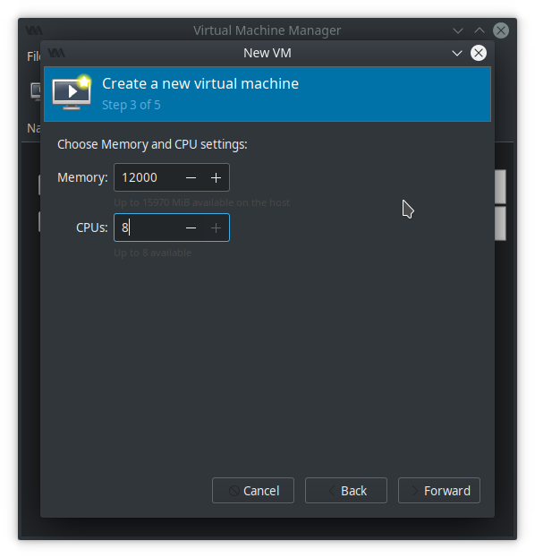
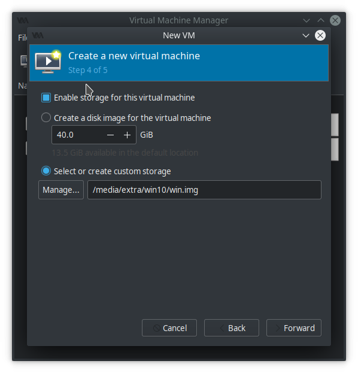
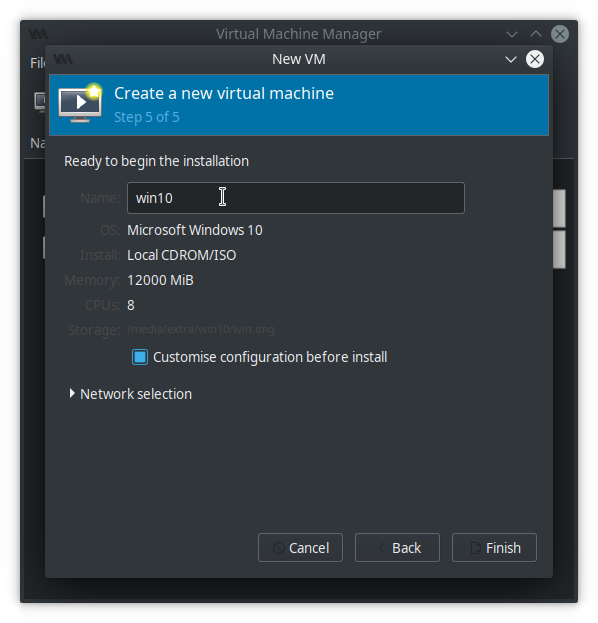
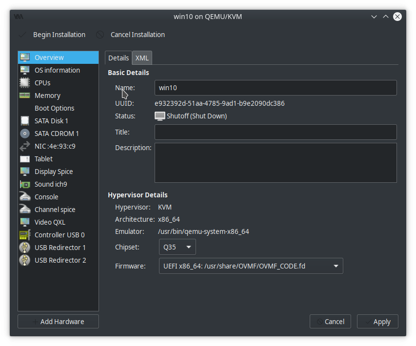
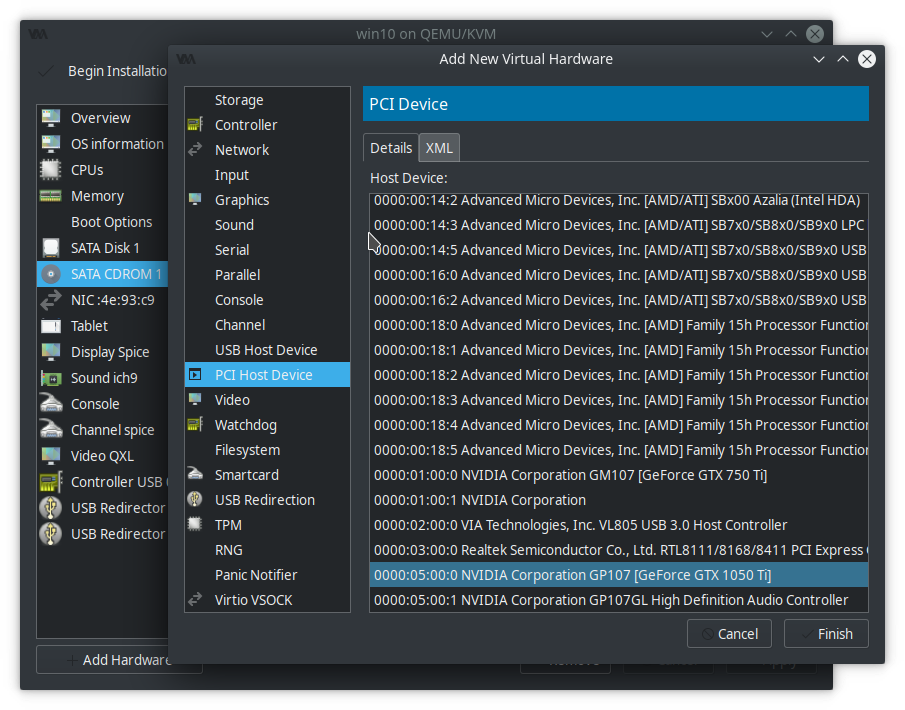
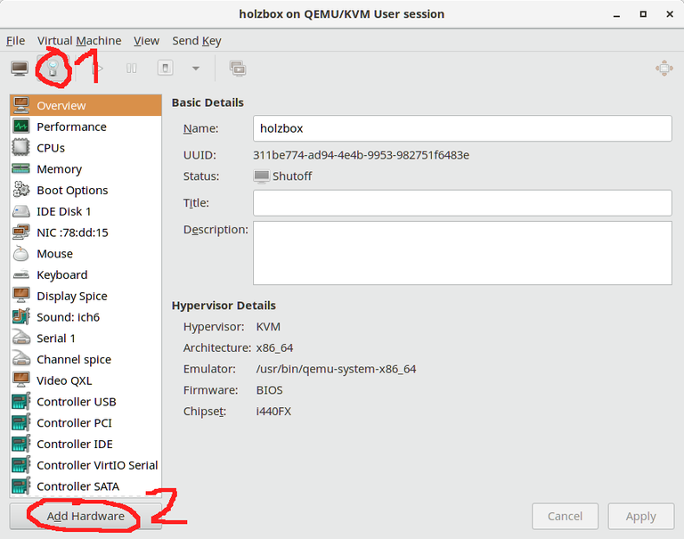
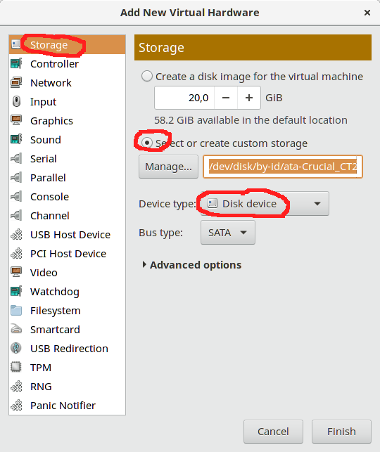

Set Up GPU Passthrough
===

This tutorial is based on this [github repository](https://github.com/xiyizi/kvm-config).

# kvm-config
XML config and startup settings for GPU-passthrough of a second nVidia card in 2 slot of mainboard

  - Operating System: Ubuntu 18.04.3 LTS
  - Kernel Version: 5.0.0-32-generic
  - OS Type: 64-bit
  - Mainboard: Asus ROG STRIX X470-F GAMING
  - Processors: 6 x AMD Ryzen 2600x Six-Core Processor
  - Memory: 32 GiB of RAM

  - Host GPU: Radeon R9 280x 3GB
  - Guest GPU: Nvidia 1080TI 8GB

  - Guest operating system: Windows 10 64bit 1903

  - Virtual Machine Manager version 1.5.1
  - qemu emulator version 4.1.90 (v4.2.0-rc0-2-g1cee80fa66-dirty)

# Key points: 
  - latest WORKING BIOS version is 4207!
  - svm must be enabled in BIOS
  - iommu group manipulation must be enabled in BIOS
  - GPU must be isolated and passed through to VFIO via script during boot process, *before* nvidia driver loads
  - the GPU you want to pass through should be in the *second* PCI-e slot

# How I did it:
[install/make](https://github.com/qemu/qemu) newest stable qemu version 

Lets get system up to date and install git, build tools for QEMU source building:  
```shell
sudo apt update && sudo apt upgrade -y; time sudo apt-get install build-essential zlib1g-dev pkg-config libglib2.0-dev binutils-dev libboost-all-dev autoconf libtool libssl-dev libpixman-1-dev libpython-dev python-pip python-capstone virtualenv ssvnc -y
```

GIT dependencies  
```shell
sudo apt update && sudo apt upgrade -y; sudo apt install make libssl-dev libghc-zlib-dev libcurl4-gnutls-dev libexpat1-dev gettext unzip -y
```

Do the installation process (can take some time (1hour), get a coffee, or some )
```shell
git clone https://git.qemu.org/git/qemu.git
cd qemu
git submodule init
git submodule update --recursive
./configure
make
sudo make install 
```

install the required packages:

`````shell
sudo apt-get install libvirt0 bridge-utils virt-manager ovmf
`````

make changes to _/etc/default/grub_:

  GRUB_CMDLINE_LINUX_DEFAULT="amd_iommu=on iommu=pt kvm_amd.npt=1 rd.modules-load=vfio-pci"
  
Update grub:

```shell
sudo update-grub
```

Reboot and check everything is all good:

```shell 
virt-host-validate
```

Identify PCI device:

```shell
lspci -nnv
```
  
Find the numbers of your nvidia GPU you want to pass through. A sound device will be part of your graphics card so pass that through too:

```shell
09:00.0 VGA compatible controller [0300]: NVIDIA Corporation GP102 [GeForce GTX 1080 Ti] [10de:1b06] (rev a1) (prog-if 00 [VGA controller])
	Subsystem: NVIDIA Corporation GP102 [GeForce GTX 1080 Ti] [10de:120f]

Audio device [0403]: NVIDIA Corporation GP102 HDMI Audio Controller [10de:10ef] (rev a1)
	Subsystem: NVIDIA Corporation GP102 HDMI Audio Controller [10de:120f]
```

The numbers I want to pass through to the VFIO driver are therefore __10de:1b06__ and **10de:10ef**. Do this by editing _/etc/modprobe.d/vfio.conf_:

```shell
softdep nvidia pre: vfio vfio_pci
softdep nvidiafb pre: vfio vfio_pci
softdep nvidia_drm pre: vfio vfio_pci
softdep nouveau pre: vfio vfio_pci
options vfio-pci ids=10de:1b06,10de:10ef disable_vga=1
```
  
And by editing _/etc/initramfs-tools/modules_:

```shell
softdep nvidia pre: vfio vfio_pci
softdep nvidiafb pre: vfio vfio_pci
softdep nvidia_drm pre: vfio vfio_pci
softdep nouveau pre: vfio vfio_pci

vfio
vfio_iommu_type1
vfio_virqfd
options vfio_pci ids=10de:1b06,10de:10ef
vfio_pci ids=10de:1b06,10de:10ef
vfio_pci
nvidiafb
nvidia
```
  
And by editing _/etc/modprobe.d/kvm.conf_:

```shell
options kvm ignore_msrs=1
```
  
Update init:
```shell
  sudo update-initramfs -u
  ```
  
Reboot and your second card should be completely isolated from your main operating system. nvidia control panel shouldn't even be able to see it even exists. You can check by running 

```shell
lspci -nnv
```
  
And checking the output:

```shell
  09:00.0 VGA compatible controller [0300]: NVIDIA Corporation GP102 [GeForce GTX 1080 Ti] [10de:1b06] (rev a1) (prog-if 00 [VGA controller])
	Subsystem: NVIDIA Corporation GP102 [GeForce GTX 1080 Ti] [10de:120f]
	Flags: bus master, fast devsel, latency 0, IRQ 100
	Memory at f6000000 (32-bit, non-prefetchable) [size=16M]
	Memory at c0000000 (64-bit, prefetchable) [size=256M]
	Memory at d0000000 (64-bit, prefetchable) [size=32M]
	I/O ports at c000 [size=128]
	Expansion ROM at f7000000 [disabled] [size=512K]
	Capabilities: <access denied>
	Kernel driver in use: vfio-pci
	Kernel modules: nvidiafb, nouveau
```

The nvidia card can now be pass through to a virtual-machine.

Now on to actually creating the virtual machine.

First, create a raw image to use as the hard disk for the virtual machine:

```shell
sudo fallocate -l 600G /var/libvirt/images/win10.img
```

Now fire up Virtual Manager and create a new machine:





I used the ISO you can download from [Microsoft's website](https://www.microsoft.com/en-gb/software-download/windows10ISO)



I didn't want my virtual machine to gobble up *all* my RAM so I only gave it 12gb.



Using the image I created earlier.



Customise installation before continuing is a must so make sure it's checked.



I used Q35 as my machine type and selected UEFI code for my firmware.



Click `add hardware` and select your nvidia card in the PCI selection. Click add hardware and also add your nvidia card's sound controller.

Begin the installation! I was brought t the UEFI bootloader screen so type `exit` to reach the boot selection screen and choose the ISO cd rom device. The monitor you have attached to your pass-through GPU may or may not work at this point. I had to take some extra steps after installation to get it to work.

Specifically, I had to run

```shell
sudo virsh edit win10
```

If you want to save your current virt-manager configuration, run:  
```shell
sudo virsh dumpxml win10 > win10-dump.xml
```

First of all find the very first line, which should read:  
```xml
<domain type='kvm'>
```

and replace it with:

```xml
<domain type='kvm' xmlns:qemu='http://libvirt.org/schemas/domain/qemu/1.0'>
```

Add the following xml in between the features brackets:

```xml
  <features>
    <acpi/>
    <apic/>
    <hyperv>
      <relaxed state="on"/>
      <vapic state="on"/>
      <spinlocks state="on" retries="8191"/>
      <vendor_id state="on" value="1234567890ab"/>
    </hyperv>
    <kvm>
      <hidden state="on"/>
    </kvm>
    <vmport state="off"/>
    <ioapic driver="kvm"/>
  </features>
```
That allowed my monitor to work on the next boot of the virtual machine. 

Now find the line which ends with `</vcpu>` and add the following block in the next line:

```xml
<vcpu placement='static'>8</vcpu>
<iothreads>1</iothreads>
<cputune>
  <vcpupin vcpu='0' cpuset='2'/>
  <vcpupin vcpu='1' cpuset='8'/>
  <vcpupin vcpu='2' cpuset='3'/>
  <vcpupin vcpu='3' cpuset='9'/>
  <vcpupin vcpu='4' cpuset='4'/>
  <vcpupin vcpu='5' cpuset='10'/>
  <vcpupin vcpu='6' cpuset='5'/>
  <vcpupin vcpu='7' cpuset='11'/>
  <emulatorpin cpuset='0,6'/>
  <iothreadpin iothread='1' cpuset='0,6'/>
</cputune>
```

Attention:Make sure `<vcpu>`, `<iothreads>` and `<cputune>` have the same indent.

Find the block `<features>`
and add the following block in parallel to the `<acpi>` block:

```xml
<hyperv> 
   <relaxed state='on'/>
   <vapic state='on'/>
   <spinlocks state='on' retries='8191'/>
</hyperv>
```

Attention:Make sure `<hyperv> `and `<acpi>` have the same indent.


Find the block `<CPU>` and adapt it to look like this:

```xml
<cpu mode='host-passthrough' check='none'>
  <topology sockets='1' cores='4' threads='2'/>
  <cache level='3' mode='emulate'/>
</cpu>
```

# Configuring Hugepages to use in a virtual machine

This is related to this [article](https://mathiashueber.com/configuring-hugepages-use-virtual-machine/)

Hugepages are an optional step during the VM configuration; it increases the RAM performance of the virtual machine. The downside is that the RAM allocated to the hugepages can not be used in the horst system, even if the guest isn’t running.

The minimum size should be not smaller then 4GB.

Check if hugepages are installed

```shell
hugeadm --explain
```

If you get the error message:  
```shell
hugeadm:ERROR: No hugetlbfs mount points found
```

install the missing package first before continuing:  
`sudo apt install hugepages`

Edit

sudo nano `/etc/default/qemu-kvm`

and add or uncomment  
```shell
`KVM_HUGEPAGES=1`
```

-> Reboot!

After the reboot, in a terminal window, enter again:
```shell
hugeadm --explain
```

Total System Memory: 32098 MB

Mount Point Options  
`/dev/hugepages rw,relatime,pagesize=2M`  
`/run/hugepages/kvm rw,relatime,gid=130,mode=775,pagesize=2M`

```text
Huge page pools: 
 Size Minimum Current Maximum Default 
 2097152 0 0 0 * 
 1073741824 0 0 0 …
```

As you can see, hugepages are now mounted to `/run/hugepages/kvm`, and the hugepage size is 2097152 Bytes/(1024*1024)=2MB.

Another way to determine the hugepage size is:
grep "Hugepagesize:" `/proc/meminfo`

Hugepagesize: 2048 kB

Some math:
We want to reserve 8GB for Windows:
8GB = 8x1024MB = 8192MB

Our hugepage size is 2MB, so we need to reserve:
8192MB/2MB = 4096 hugepages

We need to add some % extra space for overhead (some say 2%, some say 10%), to be on the safe side you can use 4500.

# Configure the hugepage pool

Again, run:

`sudo nano /etc/sysctl.conf`

and add the following lines into the file (a 16GB example):
```shell
# Set hugetables / hugepages for KVM single guest using 16GB RAM
vm.nr_hugepages = 8600
```

-> Reboot!

# Set shmmax value

test again:
```shell
hugeadm --explain
```

Total System Memory: 32098 MB

Mount Point Options  
`/dev/hugepages rw,relatime,pagesize=2M`  
`/run/hugepages/kvm rw,relatime,gid=130,mode=775,pagesize=2M`  

```text
Huge page pools: 
 Size Minimum Current Maximum Default 
 2097152 8600 8600 8600 * 
 1073741824 0 0 0 
Huge page sizes with configured pools:  
 …
``` 

find the part that reads:
The recommended shmmax for your currently allocated huge pages is 18035507200 bytes.
To make shmmax settings persistent, add the following line to `/etc/sysctl.conf`:
kernel.shmmax = 18035507200

->  Do it!

`sudo nano /etc/sysctl.conf`
add the recommended line
```shell
kernel.shmmax = 18035507200
```
-> yours may differ!

in order to use hugepages, add

```xml
<memoryBacking>
  <hugepages/>
</memoryBacking>
```

in your virsh edit.

# Improving performance on AMD CPUs

Previously, Nested Page Tables (NPT) had to be disabled on AMD systems running KVM to improve GPU performance because of a very old bug, but the trade off was decreased CPU performance, including stuttering.

There is a kernel patch that resolves this issue, which was accepted into kernel 4.14-stable and 4.9-stable. If you are running the official linux or linux-lts kernel the patch has already been applied (make sure you are on the latest). If you are running another kernel you might need to manually patch yourself.
Note: Several Ryzen users (see this Reddit thread) have tested the patch, and can confirm that it works, bringing GPU passthrough performance up to near native quality.

Starting with QEMU 3.1 the TOPOEXT cpuid flag is disabled by default. In order to use hyperthreading(SMT) on AMD CPU's you need to manually enable it:

```xml
 <cpu mode='host-passthrough' check='none'>
 <topology sockets='1' cores='4' threads='2'/>
 <feature policy='require' name='topoext'/>
 </cpu>
```

# How to add a physical device or physical partition as virtual hard disk under virt-manager

```shell
$ ls -l /dev/disk/by-id/
insgesamt 0
lrwxrwxrwx 1 root root 9 23. Jul 21:05 ata-Crucial_CT256MX100SSD1_14360D295569 -> ../../sda
lrwxrwxrwx 1 root root 10 23. Jul 21:05 ata-Crucial_CT256MX100SSD1_14360D295569-part1 -> ../../sda1
lrwxrwxrwx 1 root root 10 23. Jul 21:05 ata-Crucial_CT256MX100SSD1_14360D295569-part2 -> ../../sda2
```

Add the device or partition to your existing virtual machine. In virt-manager, open the virtual machine window.



Click on the light bulb to bring up the virtual hardware details. Then select Add Hardware at the bottom.



We want to add a storage, and as device type choose Disk Device. Choose the radio button labelled “Select or create custom storage”. In the corresponding text input field, paste the name of the physical device or partition that you chose before. Set the Bus type to your liking, usually SATA or IDE are a good choice.  Click finish and the physical device is added.

Make sure the boot device is what you want it to be.

# Evdev Passthrough Mouse, Keyboard  

Input is often the first hurdle presented after getting a passthrough VM up and running. Without Spice or VNC, users often resort to hacks and workarounds to control their virtual machine. Passing through USB devices via evdev has become a popular if badly documented way of handling input. The advantage of evdev is that it has very low latency and overhead. The downside is that it becomes frustrating to switch between the host and guest.

While a physical KVM switch will always be a viable option, complete solutions with modern video connectors can be very expensive, and start to eat into a build budget when compounded with other hardware quality of life improvements. Evdev passhthrough is a good alternative for those  that can’t afford hardware solutions but still want low latency and accurate input.

## What is Evdev?

Evdev is an input interface built into the Linux kernel. QEMU’s evdev passthrough support allows a user to redirect evdev events to a guest. These events can include mouse movements and key presses. By hitting both Ctrl keys at the same time, QEMU can toggle the input recipient. QEMU’s evdev passthrough also features almost no latency, making it perfect for gaming. The main downside to evdev passthrough is the lack of button rebinding – and in some cases, macro keys won’t even work at all.

This setup has no requirements besides a keyboard, mouse, and working passthrough setup. This guide assumes you have already configured these.

## Configuring Evdev

To start, you will need to find the input device IDs for your mouse and keyboard. This can get a little finicky, as some keyboard manufacturers do this differently. The Linux kernel exposes two different locations for evdev devices: `/dev/input`, and `/dev/input/by-id`. `/dev/input/by-id` is generally preferred, as you can pass through input devices without worrying about the file path changing if you plug/unplug additional devices. List the contents of this directory:

```shell
ls /dev/input/by-id
```

It will contain your input devices. Take note of which ones you want to pass through. Be careful here, as I have noticed two common discrepancies. The first is an “if01” or “if02” or similar near the end of an input device name. The best method to find out which one is correct is to use “cat.” Run:

```shell
cat /dev/input/by-id/[input device id]
```

Press random keys on the keyboard you want to pass through. If garbled characters appear on-screen, you have selected the correct one. If not, try another until you find the correct one. Use Ctrl+C to cancel the “cat” process. Another issue to be wary of is the input device type. A lot of mice will have keyboard inputs, and some keyboards even have mouse inputs. Select the input device that corresponds to your device. For example, if you see two entries for your keyboard, with one ending with “event-kbd”  and the other ending with “event-mouse,” you will generally want to pick “event-kbd.” Some hardware manufacturers hate following standards, though, and you might find yourself needing to switch this up.

Now that you’ve noted the devices you want to use evdev with, it’s time to enable it in your libvirt XML. Open the XML with the following, replacing “nano” with your editor of choice, and “win10” with the name of your libvirt domain:

`nano virsh edit win10`

Make sure the first line looks like this:  

```shell
<domain type='kvm' id='1' xmlns:qemu='http://libvirt.org/schemas/domain/qemu/1.0'>
```

If it doesn’t, replace the first line with that. Next, add the following near the bottom, directly above `</domain>`:

```shell
<qemu:commandline>
  <qemu:arg value='-object'/>
  <qemu:arg value='input-linux,id=mouse1,evdev=/dev/input/by-id/MOUSE_NAME'/>
  <qemu:arg value='-object'/>
  <qemu:arg value='input-linux,id=kbd1,evdev=/dev/input/by-id/KEYBOARD_NAME,grab_all=on,repeat=on'/>
</qemu:commandline>
```

If you already have qemu:commandline set up for whatever reason, add the qemu:arg options above to that section. Don’t add another set of qemu:commandline arguments. Replace the `MOUSE_NAME` and `KEYBOARD_NAME` parts with the id of your input devices. Next, save the XML. In nano, you can do this with Ctrl+X, then Y, then Enter. Boot up your VM. It should now work, with the keyboard and mouse being directly passed to the VM! By hitting **both Ctrl keys at the same time**, you can switch between hosts. Wonderful, isn’t it?

I had to use the following block in my win10 xml to get things working:  

```xml
<qemu:commandline>
    <qemu:arg value='-object'/>
    <qemu:arg value='input-linux,id=mouse1,evdev=/dev/input/by-id/usb-MOSART_Semi._2.4G_Keyboard_Mouse-if01-event-mouse'/>
    <qemu:arg value='-object'/>
    <qemu:arg value='input-linux,id=kbd1,evdev=/dev/input/by-id/usb-Logitech_USB_Receiver-event-kbd,grab_all=on,repeat=on'/>
  </qemu:commandline>
</domain>
```

## Troubleshooting
### Permission Errors

There are a wide variety of causes for permission issues with evdev passthrough. To start, let’s set up cgroup_device_acl in libvirt’s configuration. Ensure the following is in `/etc/libvirt/qemu.conf`, of course replacing `KEYBOARD_NAME` and `MOUSE_NAME`:

```shell
cgroup_device_acl = [
        "/dev/null", "/dev/full", "/dev/zero", 
        "/dev/random", "/dev/urandom",
        "/dev/ptmx", "/dev/kvm", "/dev/kqemu",
        "/dev/rtc","/dev/hpet",
        "/dev/input/by-id/KEYBOARD_NAME",
        "/dev/input/by-id/MOUSE_NAME"
]
```

Now restart libvirtd with  

```shell
systemctl restart libvirtd
```

for OpenRC distributions like Gentoo and Artix.
If this still throws a permission error, the likely cause is that qemu is running as a user that does not have access to the input devices for security reasons. There are a few ways to get around this by changing the user that libvirt spawns the qemu process as (note that this will most likely break any PulseAudio passthrough you may have done, if you already updated this to your user):

```shell
user = "root"
group = "root"
```

This method is a bit overkill, as it effectively removes all sandboxing that libvirt applies by running the user as a non-root user by default. If you don’t use pulseaudio, and you still want sandboxing, then follow the instructions here:
First, create a new user/group to sandbox as, for example “evdev”:

```shell
useradd -s /usr/sbin/nologin -r -M -d /dev/null evdev
groupadd evdev
usermod -a -G input evdev
```

With that done, you’ve now created a user that has no home directory that can’t normally be logged into from a login shell, and added the new user to the input group that is necessary to read the files for evdev. Following this, update the qemu.conf to reflect these changes:

```shell
user = "evdev"
group = "evdev"
```

Finally, if you do require PulseAudio, all you need to do is add your user to the input group (Assuming that you already have PulseAudio working properly.)

```shell
gpasswd -a <your user> input
```

If this still throws a permission error, set the following in the same file:

```shell
clear_emulator_capabilities = 0
```

If this still throws a permission error, execute the ollowing command:  

```shell
chown root:kvm /dev/kvm
```

If this still throws a permission error, execute the ollowing command:  

Add the folowing to `/etc/apparmor.d/abstractions/libvirt-qemu`

```shell
/dev/input/* rw,
```

Then restart apparmor:  
`sudo service apparmor restart`  

Any permission issues should now be solved.

My settings in `/etc/libvirt/qemu.conf` for my setup are the following:

```shell
user = "root"
group = "root"
clear_emulator_capabilities = 0

cgroup_device_acl = [
    "/dev/null", "/dev/full", "/dev/zero",
    "/dev/random", "/dev/urandom",
    "/dev/ptmx", "/dev/kvm", "/dev/kqemu",
    "/dev/rtc","/dev/hpet",
    "/dev/input/by-id/usb-Logitech_USB_Receiver-event-kbd",
    "/dev/input/by-id/usb-MOSART_Semi._2.4G_Keyboard_Mouse-if01-event-mouse"
]
```

The whole xml file from `sudo virsh edit win10`  
```xml
<domain type='kvm' id='1' xmlns:qemu='http://libvirt.org/schemas/domain/qemu/1.0'>
  <name>win10</name>
  <uuid>915bbb74-196a-442d-b432-a137ae31b6f4</uuid>
  <memory unit='KiB'>16777216</memory>
  <currentMemory unit='KiB'>16777216</currentMemory>
  <memoryBacking>
    <hugepages/>
  </memoryBacking>
  <vcpu placement='static'>8</vcpu>
  <iothreads>1</iothreads>
  <cputune>
    <vcpupin vcpu='0' cpuset='2'/>
    <vcpupin vcpu='1' cpuset='8'/>
    <vcpupin vcpu='2' cpuset='3'/>
    <vcpupin vcpu='3' cpuset='9'/>
    <vcpupin vcpu='4' cpuset='4'/>
    <vcpupin vcpu='5' cpuset='10'/>
    <vcpupin vcpu='6' cpuset='5'/>
    <vcpupin vcpu='7' cpuset='11'/>
    <emulatorpin cpuset='0,6'/>
    <iothreadpin iothread='1' cpuset='0,6'/>
  </cputune>
  <resource>
    <partition>/machine</partition>
  </resource>
  <os>
    <type arch='x86_64' machine='pc-q35-2.11'>hvm</type>
    <loader readonly='yes' type='pflash'>/usr/share/OVMF/OVMF_CODE.fd</loader>
    <nvram>/var/lib/libvirt/qemu/nvram/win10_VARS.fd</nvram>
    <boot dev='hd'/>
  </os>
  <features>
    <acpi/>
    <apic/>
    <hyperv>
      <relaxed state='on'/>
      <vapic state='on'/>
      <spinlocks state='on' retries='8191'/>
      <vendor_id state='on' value='1234567890ab'/>
    </hyperv>
    <kvm>
      <hidden state='on'/>
    </kvm>
    <vmport state='off'/>
    <ioapic driver='kvm'/>
  </features>
  <cpu mode='host-passthrough' check='none'>
    <topology sockets='1' cores='4' threads='2'/>
    <cache level='3' mode='emulate'/>
    <feature policy='require' name='topoext'/>
  </cpu>
  <clock offset='localtime'>
    <timer name='rtc' tickpolicy='catchup'/>
    <timer name='pit' tickpolicy='delay'/>
    <timer name='hpet' present='no'/>
    <timer name='hypervclock' present='yes'/>
  </clock>
  <on_poweroff>destroy</on_poweroff>
  <on_reboot>restart</on_reboot>
  <on_crash>destroy</on_crash>
  <pm>
    <suspend-to-mem enabled='no'/>
    <suspend-to-disk enabled='no'/>
  </pm>
  <devices>
    <emulator>/usr/bin/kvm-spice</emulator>
    <disk type='file' device='disk'>
      <driver name='qemu' type='raw'/>
      <source file='/var/libvirt/images/win10.img'/>
      <backingStore/>
      <target dev='sda' bus='sata'/>
      <alias name='sata0-0-0'/>
      <address type='drive' controller='0' bus='0' target='0' unit='0'/>
    </disk>
    <disk type='file' device='cdrom'>
      <driver name='qemu' type='raw'/>
      <source file='/home/desktop/Downloads/Win10_1903_V2_German_x64.iso'/>
      <backingStore/>
      <target dev='sdb' bus='sata'/>
      <readonly/>
      <alias name='sata0-0-1'/>
      <address type='drive' controller='0' bus='0' target='0' unit='1'/>
    </disk>
    <disk type='block' device='disk'>
      <driver name='qemu' type='raw' cache='none' io='native'/>
      <source dev='/dev/disk/by-id/ata-OCZ-TRION100_95UB60EOKMGX'/>
      <backingStore/>
      <target dev='sdc' bus='sata'/>
      <alias name='sata0-0-2'/>
      <address type='drive' controller='0' bus='0' target='0' unit='2'/>
    </disk>
    <controller type='usb' index='0' model='ich9-ehci1'>
      <alias name='usb'/>
      <address type='pci' domain='0x0000' bus='0x00' slot='0x1d' function='0x7'/>
    </controller>
    <controller type='usb' index='0' model='ich9-uhci1'>
      <alias name='usb'/>
      <master startport='0'/>
      <address type='pci' domain='0x0000' bus='0x00' slot='0x1d' function='0x0' multifunction='on'/>
    </controller>
    <controller type='usb' index='0' model='ich9-uhci2'>
      <alias name='usb'/>
      <master startport='2'/>
      <address type='pci' domain='0x0000' bus='0x00' slot='0x1d' function='0x1'/>
    </controller>
    <controller type='usb' index='0' model='ich9-uhci3'>
      <alias name='usb'/>
      <master startport='4'/>
      <address type='pci' domain='0x0000' bus='0x00' slot='0x1d' function='0x2'/>
    </controller>
    <controller type='sata' index='0'>
      <alias name='ide'/>
      <address type='pci' domain='0x0000' bus='0x00' slot='0x1f' function='0x2'/>
    </controller>
    <controller type='pci' index='0' model='pcie-root'>
      <alias name='pcie.0'/>
    </controller>
    <controller type='pci' index='1' model='dmi-to-pci-bridge'>
      <model name='i82801b11-bridge'/>
      <alias name='pci.1'/>
      <address type='pci' domain='0x0000' bus='0x00' slot='0x1e' function='0x0'/>
    </controller>
    <controller type='pci' index='2' model='pci-bridge'>
      <model name='pci-bridge'/>
      <target chassisNr='2'/>
      <alias name='pci.2'/>
      <address type='pci' domain='0x0000' bus='0x01' slot='0x00' function='0x0'/>
    </controller>
    <controller type='pci' index='3' model='pcie-root-port'>
      <model name='pcie-root-port'/>
      <target chassis='3' port='0x10'/>
      <alias name='pci.3'/>
      <address type='pci' domain='0x0000' bus='0x00' slot='0x02' function='0x0' multifunction='on'/>
    </controller>
    <controller type='pci' index='4' model='pcie-root-port'>
      <model name='pcie-root-port'/>
      <target chassis='4' port='0x11'/>
      <alias name='pci.4'/>
      <address type='pci' domain='0x0000' bus='0x00' slot='0x02' function='0x1'/>
    </controller>
    <controller type='pci' index='5' model='pcie-root-port'>
      <model name='pcie-root-port'/>
      <target chassis='5' port='0x12'/>
      <alias name='pci.5'/>
      <address type='pci' domain='0x0000' bus='0x00' slot='0x02' function='0x2'/>
    </controller>
    <controller type='pci' index='6' model='pcie-root-port'>
      <model name='pcie-root-port'/>
      <target chassis='6' port='0x13'/>
      <alias name='pci.6'/>
      <address type='pci' domain='0x0000' bus='0x00' slot='0x02' function='0x3'/>
    </controller>
    <controller type='pci' index='7' model='pcie-root-port'>
      <model name='pcie-root-port'/>
      <target chassis='7' port='0x14'/>
      <alias name='pci.7'/>
      <address type='pci' domain='0x0000' bus='0x00' slot='0x02' function='0x4'/>
    </controller>
    <controller type='pci' index='8' model='pcie-root-port'>
      <model name='pcie-root-port'/>
      <target chassis='8' port='0x8'/>
      <alias name='pci.8'/>
      <address type='pci' domain='0x0000' bus='0x00' slot='0x01' function='0x0'/>
    </controller>
    <controller type='virtio-serial' index='0'>
      <alias name='virtio-serial0'/>
      <address type='pci' domain='0x0000' bus='0x03' slot='0x00' function='0x0'/>
    </controller>
    <interface type='network'>
      <mac address='52:54:00:1b:7c:42'/>
      <source network='default' bridge='virbr0'/>
      <target dev='vnet0'/>
      <model type='rtl8139'/>
      <alias name='net0'/>
      <address type='pci' domain='0x0000' bus='0x02' slot='0x01' function='0x0'/>
    </interface>
    <input type='mouse' bus='ps2'>
      <alias name='input0'/>
    </input>
    <input type='keyboard' bus='ps2'>
      <alias name='input1'/>
    </input>
    <hostdev mode='subsystem' type='pci' managed='yes'>
      <driver name='vfio'/>
      <source>
        <address domain='0x0000' bus='0x09' slot='0x00' function='0x0'/>
      </source>
      <alias name='hostdev0'/>
      <address type='pci' domain='0x0000' bus='0x04' slot='0x00' function='0x0'/>
    </hostdev>
    <hostdev mode='subsystem' type='pci' managed='yes'>
      <driver name='vfio'/>
      <source>
        <address domain='0x0000' bus='0x09' slot='0x00' function='0x1'/>
      </source>
      <alias name='hostdev1'/>
      <address type='pci' domain='0x0000' bus='0x05' slot='0x00' function='0x0'/>
    </hostdev>
    <hostdev mode='subsystem' type='usb' managed='yes'>
      <source>
        <vendor id='0x1235'/>
        <product id='0x8211'/>
        <address bus='3' device='3'/>
      </source>
      <alias name='hostdev2'/>
      <address type='usb' bus='0' port='2'/>
    </hostdev>
    <memballoon model='virtio'>
      <alias name='balloon0'/>
      <address type='pci' domain='0x0000' bus='0x06' slot='0x00' function='0x0'/>
    </memballoon>
  </devices>
  <seclabel type='dynamic' model='apparmor' relabel='yes'>
    <label>libvirt-915bbb74-196a-442d-b432-a137ae31b6f4</label>
    <imagelabel>libvirt-915bbb74-196a-442d-b432-a137ae31b6f4</imagelabel>
  </seclabel>
  <seclabel type='dynamic' model='dac' relabel='yes'>
    <label>+0:+0</label>
    <imagelabel>+0:+0</imagelabel>
  </seclabel>
  <qemu:commandline>
    <qemu:arg value='-object'/>
    <qemu:arg value='input-linux,id=mouse1,evdev=/dev/input/by-id/usb-MOSART_Semi._2.4G_Keyboard_Mouse-if01-event-mouse'/>
    <qemu:arg value='-object'/>
    <qemu:arg value='input-linux,id=kbd1,evdev=/dev/input/by-id/usb-Logitech_USB_Receiver-event-kbd,grab_all=on,repeat=on'/>
  </qemu:commandline>
</domain>
```


# Helpful links
https://github.com/xiyizi/kvm-config 

https://ckirbach.wordpress.com/2017/07/25/how-to-add-a-physical-device-or-physical-partition-as-virtual-hard-disk-under-virt-manager/

https://mathiashueber.com/cpu-pinning-on-amd-ryzen/#Virtual-machine-CPU-configuration

https://heiko-sieger.info/running-windows-10-on-linux-using-kvm-with-vga-passthrough/#Two_graphics_processors

https://wiki.archlinux.org/index.php/PCI_passthrough_via_OVMF#CPU_pinning

https://mathiashueber.com/configuring-hugepages-use-virtual-machine/

https://passthroughpo.st/using-evdev-passthrough-seamless-vm-input/

https://bbs.archlinux.org/viewtopic.php?id=69454